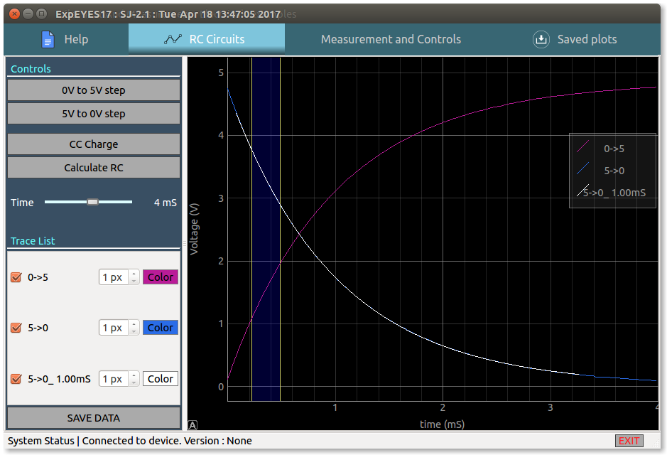
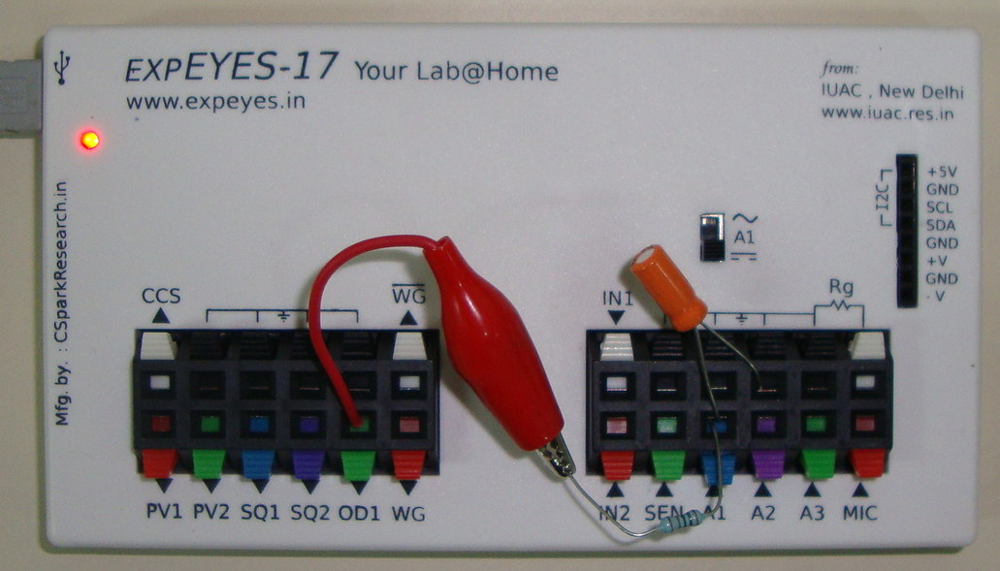

# RC circuit, Transient response

{: width="700px"}

## The following constant voltage charging/discharging transitions can be recorded with the above schematic
+ 0 - 5V step : the capacitor is first drained by setting OD1 to 0V , then OD1 is set to 5V and the charging curve is recorded
+ 5V - 0V step : the capacitor is first charged by setting OD1 to 5V , then OD1 is set to 0V and the discharge curve is recorded

## Charging characteristics with a constant current source
+ The capacitor is connected between CCS and GND, and the charging curve is recorded via the internal current source voltage monitor.

{: width="700px"}

+ A voltage step is applied to a series RC circuit and the voltage across
the capacitor is recorded.

## Analysis

- Drag the blue region using its handles on either side, and click on the 'Calculate RC' button . 
- The RC time constant of the last obtained data is calculated , and a new plot is overlaid on the original dataset

## Photograph of the setup for constant voltage charging

{: width="700px"}
