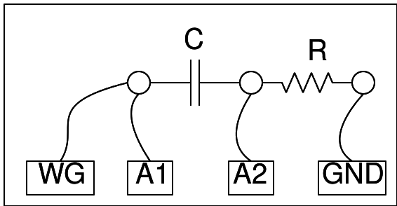

## Schematic
___	

## Instructions
___

- To start with, choose C = 1uF and R = 1 kOhm. Set the frequency to 150 Hz. 
- Measure the phase shift and compare it with the calculated value.
- Repeat it for different frequencies. 
- Try with different R and C values.
