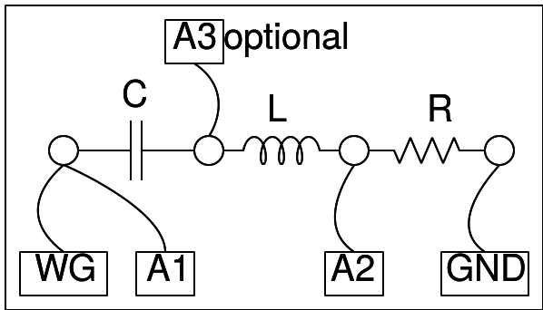

## Schematic
___

## Instructions
___
- Choose C = 1uF and L = 10 mH. Set the frequency to around 1600 Hz, 
- adjust it to make to make the voltage across LC (blue trace) minimum.
- It will not become zero due to the resistance of the inductor (20 Ohm).
- Toggle the "Show Vcap & Vind" switch to view the voltage across L and C,
they are out of phase at resonance.
