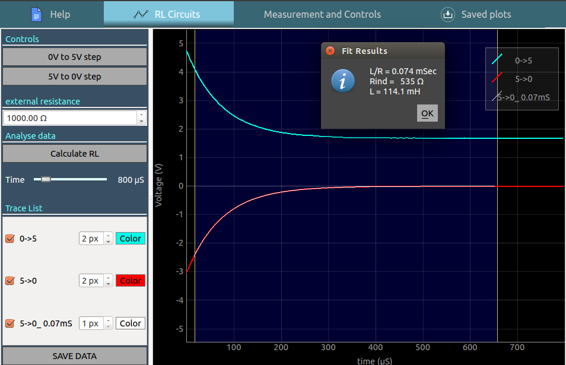
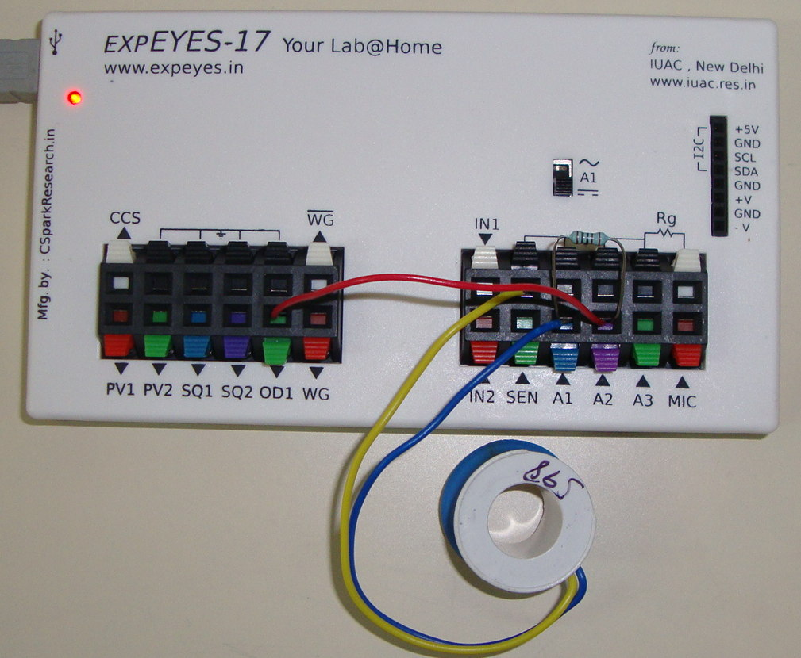

# RL circuit, Transient response
___
- A voltage step is applied to a series RL circuit and the voltage across
the inductor is recorded.

## Schematic
___
{: width="700px"}

## The following constant voltage charging/discharging transitions can be recorded with the above schematic
+ 0 - 5V step : OD1 is first set to to 0V . After a stabilisation delay of 0.5 seconds, it is set to 5V , and the transient behaviour is recorded
+ 5V - 0V step : OD1 is first set to to 5V . After a stabilisation delay of 0.5 seconds, it is set to 0V , and the transient behaviour is recorded

{: width="700px"}

## Analysis
___

- Drag the blue region using its handles on either side, and click on the 'Calculate RL' button . 
- The RL time constant of the last obtained data is calculated , and a new plot is overlaid on the original dataset

## Photograph of the setup 
___

{: width="700px"}
