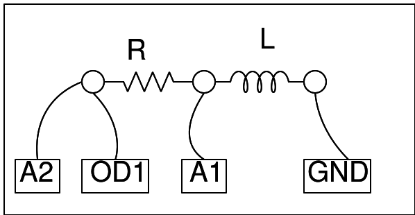

## Schematic
___

## Instructions
___
- A voltage step is applied to the inductor via the resistor.
- The resulting voltage across the inductor is captured and plotted.
- Note the change of direction of the voltage, due to back EMF.
