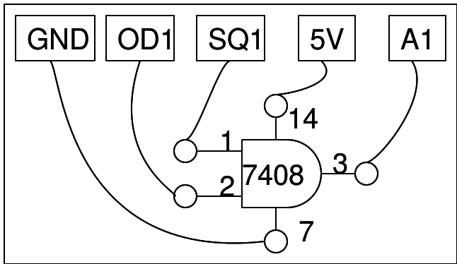

## Schematic
___
{: width="700px"}

## Instructions
___

- Make the connetions, on a breadboard.

- Set SQ1 to 100 Hz, watch both A1 and A2

- Toggle OD1 and watch the difference in the output. Make the truth table.

{: width="600px"}

