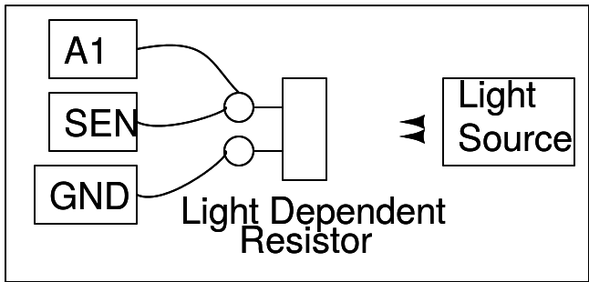

## Schematic
___	

___
## Instructions

- Make the connections as shown in the figure.
- Compare the output at A1 using sunlight and the light from a fluorescent tube.
- Is there any AC component in the case of fluorescent tube?
