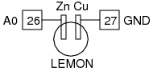

## Schematic  
___

## Instructions
___
- Make a lemon cell and connect as shown in the figure, measure the voltage at A1.
- Connect a 1K resistor and measure the voltage again. 
- The voltage drops because of the internal resistance of the cell.
