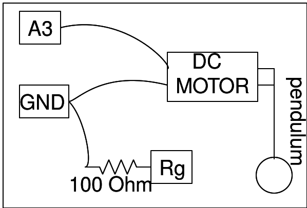

## Using a DC motor as a velocity sensor

The object of this experiment is to find out the time period of oscillations of a simple pendulum. In order to measure the speed of oscillations as a function of time, we construct the following apparatus:
* Fix a pendulum to the pivot of a DC motor.
* Since the DC motor is essentially a coil in the vicinity of a permanent magnet, it also behaves as a dynamo when the pivot is rotated by an external source
* We connect the motor's wires to A3 (A high impedance voltmeter), and GND
* When the pendulum is moved, a voltage proportional to its velocity is induced across the motor's coils, since the EMF is proportional to the rate of change of magnetic flux
* Simply monitoring this voltage as a function of time enables us to estimate the time period as well as the damping coefficient using curve fitting functions.

{: width="400px"}



