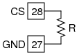

## Schematic
___

## Instructions
___
- Connect the resistor from SEN to Ground( any black terminal)
- The value will be displayed in the "Measurements & Control Section"
- The valid range is from 100 Ohm to 100 kOhm
