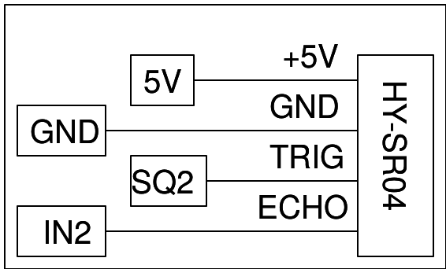

## Schematic
___
{: width="500px"}

- Make the connections and keep a flat object in front of the sensor.

- Press the START button to record the distance as a function of time.

- After acquiring a dataset, you can use the fit function to extract parameters such as frequency and the damping coefficient.
## Photograph
___
{: width="500px"}

