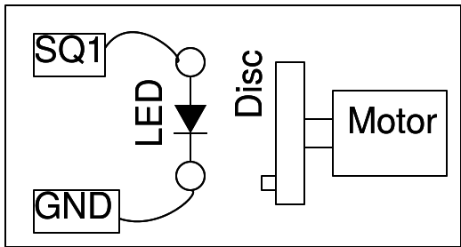

## Schematic
___

## Instructions
___
- The disk is rotated by powering the motor by a 1.5 V cell.
- The disk is illuminated with light from the LED only, no other light should be present. 
- Adjust the frequency of SQ1, the disk will appear stationary when it is equal to the frequency
  of rotation of the disk.
