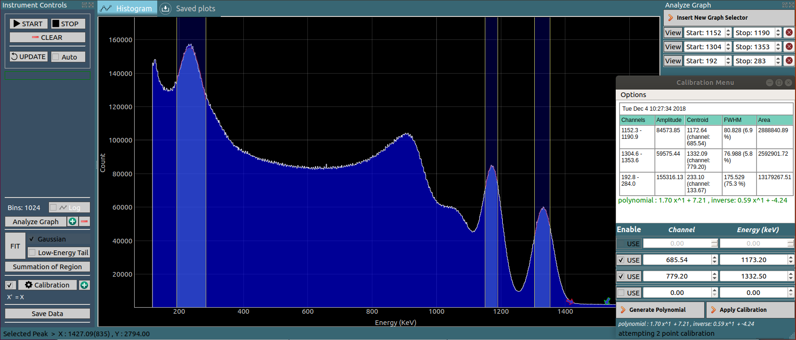




<table style="color:white;">
  <tr>
    <td>+ Compatible with our Multi Channel analyzers, Alpha, and Gamma Spectrometers.</td>
    <td></td>
    <td rowspan="5"></td>
  </tr>
  <tr>
    <td>+ Analysis : multi-point calibration, Gaussian Fitting, Low-Energy tail fitting, summation etc.</td>
  </tr>
  <tr>
    <td>+ Offline Data analysis</td>
  </tr>
  <tr>
    <td>+ LGPL licensed source code supplied along with the instrument.</td>
  </tr>
  <tr>
    <td>+ Python library for acquisition and analysis.</td>
  </tr>

</table>

---

### Using the Python library
---
CNSPEC version > 6.0.0 must be installed. 
Or download the library : [MCALib.py](assets/MCALib.py), and make sure the following packages are installed
+ python3
+ python3-numpy
+ python3-scipy
+ matplotlib


### Capture data from an instrument and plot it: [example.py](assets/example.py)
---
Create a new python file. In case you downloaded [MCALib.py](assets/MCALib.py) , it must be located in the same directory.

+ Initialization

```Python
import time,sys
from MCALib import connect

device = connect(autoscan = True) # automatically detect the hardware
#device = connect(port = '/dev/ttyUSB0')  #Search on specified port
```

+ Check if successfully connected

```Python
if not device.connected:
	print("device not found")
	sys.exit(0)
```

+ Start acquiring data

```Python
print("Device Version",device.version,device.portname) #Display the version number

device.startHistogram()  #start data acquisition
time.sleep(5) # Wait for 5 seconds for gather some events.
```

+ Retrieve data from the hardware, and plot it

```Python
device.sync() # fetch data from the hardware
x = device.getHistogram()  # Array of counts

from matplotlib import pyplot as plt
plt.plot(x)
plt.show()
```


### Offline data analysis: [offline_example.py](assets/offline_example.py)
---
Create a new python file. In case you downloaded [MCALib.py](assets/MCALib.py) , it must be located in the same directory.

+ Initialization

```Python
import time,sys
import numpy as np
from MCALib import connect

dev = connect()  # 'dev' contains a range of methods for acquisition and analysis
```

+ Load data from a text file(csv, txt, dat...)

```Python
fname = 'bi212.csv'  #Supply your filename here.
dev.loadFile(fname)
# Get the data. Supply an optional name argument in case of multiple files/connected hardware.
x = dev.getHistogram() #name = fname / name='/dev/ttyUSB0'
```

+ Display its contents. ( optional step )

```Python
np.set_printoptions(threshold = np.inf,precision = 0,suppress=True) #print the whole array. No decimal Points. Suppress scientific notation
print (x)
```

+ Plot the spectrum with matplotlib

```Python
import matplotlib.pyplot as plt
plt.plot(x) #Plot RAW data
```

+ Attempt a gaussian fit around the first peak located between channels 500 and 600

```Python
FIT = dev.gaussianFit([500,600]) #Apply a gaussian FIT between 500 and 600 channel.
if FIT: #If fit was successful
	plt.plot(FIT['X'],FIT['Y']) #Plot fitted data
	print('Gaussian Fit : ',FIT['centroid'],FIT['fwhm'])
```

+ Attempt a Gaussian+Low-energy Tail(Lorentzian) fit around the second peak located between channels 750 and 850

```Python
FIT = dev.gaussianTailFit([750,850]) #Apply a gaussian+Lorentzian FIT between 700 and 900 channel.
if FIT:
	plt.plot(FIT['X'],FIT['Y']) #Plot fitted data
	print('Gaussian+low energy tail Fit : ',FIT['centroid'],FIT['fwhm'])
```

+ Show the matplotlib window

```Python
plt.show()
```
