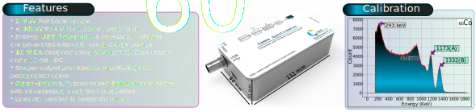
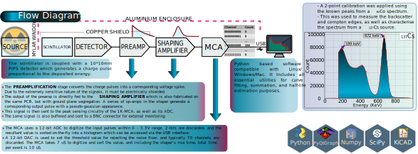
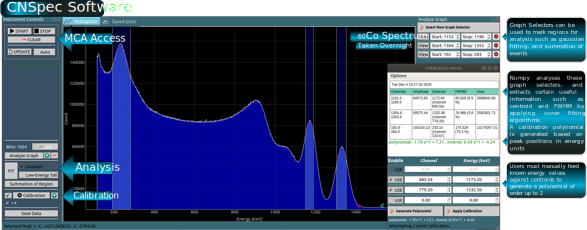





	  <a href="#">
		    CSpark Research : Gamma Spectrometer
	  </a>

    
                                
        

            

                
Gamma Spectrometer : with 1K MCA

            

   + Highly compact portable spectrometer which is fully USB Powered.
   + Presented at the DAE Symposium for Nuclear Physics 2018 : [Conference Proceedings](http://sympnp.org/proceedings/63/G19.pdf)
   + Accepted for Recent Issues in Nuclear and Particle Physics (RINP2, Viswa Bharati) : [Contribution](https://indico.cern.ch/event/763807/contributions/3274494/)

			<a class = "desc" href="/assets/posters/gammaweb.svg"><button role="button" >BROCHURE</button></a>

        

    
                        

    





### Poster 
---

______

### Coincidence Measurements with minimal added cost

The MCA is designed to emit a programmable width digital pulse per event, and also accept digital input pulses
which will then act as secondary discriminators for recording events. Demonstrable coincidence results can be obtained
using just a cable connected from one spectrometer to the other. Conference abstract pending review.

### Environment monitoring

These spectrometers have been tested with natural sources such as gas mantles dipped in thorium, and monazite sand.

* e-mail csparkresearch@gmail.com for enquiries
