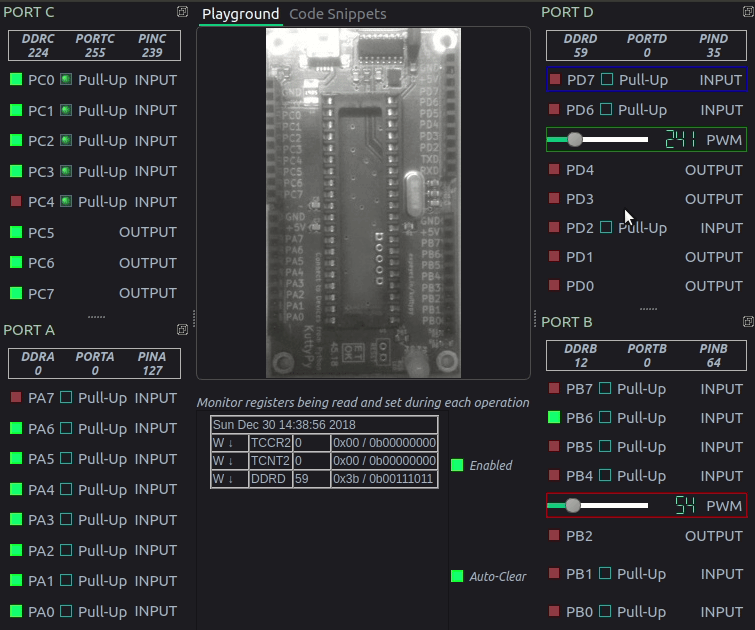
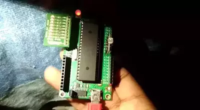




<div style="text-align:center"></div>


## Introduction
---
### Microcontroller training board for beginners

<table style="color:white;">
  <tr>
    <td>+ Fancy UI with click-and-explore features.</td>
    <td></td>
    <td rowspan="5"></td>
  </tr>
  <tr>
    <td>+ Explicitly displays all registers modified for each operation.</td>
  </tr>
  <tr>
    <td>+ Direct Register level access, and tweaking tools.</td>
  </tr>
  <tr>
    <td>+ Monitoring utilities built into the bootloader.</td>
  </tr>
  <tr>
    <td>+ Upload your own compiled C code, and use as a serial monitor!</td>
  </tr>

</table>

---
The kuttyPy (/kʊtipʌɪ/) Microcontroller training utility allows real-time manipulation of the registers in microcontrollers via a connected computer containing its python library.  setReg and getReg function calls act as a real-time debugging and monitoring utility, and combined with Python's visualization and analytical utilities, this approach has immense pedagogical potential for beginners. 

The kuttyPy hardware is an ATMEGA32 microcontroller development board developed by the [ExpEYES](http://expeyes.in) project, and is currently supported by this software. It contains the kuttyPy firmware, but can also be used to run other programs via its bootloader.

## Software



### Installation from source (License: MIT)
---
+ Install dependencies (Ubuntu 18.04)
```
sudo apt-get install python3 python3-serial python3-pyqt5 python3-pyqt5.qtsvg
```
+ Clone the repository, and run the file
```
git clone https://github.com/csparkresearch/kuttypy-gui
cd kuttypy-gui
python3 KuttyPyGUI.py
```

## Examples and Features

### 8 Channel voltmeter, 0-5000 mV [ Without Analog Frontend ]

  
### Simple blink.py example
---
 

Monitor your code's activity while it executes


Add custom register blocks, twiddle bits, and observe!
In this demo, the ADC is read by first setting the bits in the ADCSRA(control and status register), then reading back ADCL(8LSB)+ADCH(2MSB), and also checking the new status of ADCSRA after the operation.

### Plotting ADC values using matplotlib
 

 

Plug and play various accessories such as this Hall Sensor, & servo motor.

### Plug and Play I2C devices ..
 

The MCP4725 12-bit single channel DAC is connected to the I2C port, and its output is connected to A0 for monitoring. 

## Seamless switching between the KuttyPy monitor, and user uploaded hex file.
---
The KuttyPy monitor code is part of the bootloader. This allows users to upload their own Hex files without losing the training utility features.


This example shows how to skip back and forth to an LED scanning code (which also prints letters to the serial port) written in C and uploaded.

In the animation, after fiddling a little with the PWM controls on the monitor, the 'user app' button is clicked. This triggers the following:
+ Within a few ten milliseconds the user uploaded hex file starts executing
+ The console turns into a serial monitor, and shows any text sent by the user uploaded hex.

The user can switch back to the monitoring utility in a snap!

### Persistence of vision


A persistence of vision display made with C code! Write text in thin air using 8 LEDs on PORTB.


---
Developed by Jithin B.P @CSpark Research, 2018.  
Special thanks to Georges Khazanadar for Debianizing efforts.
