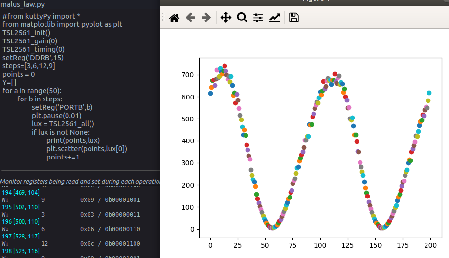
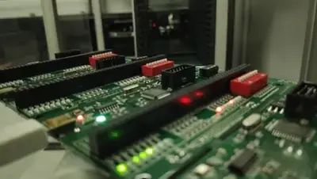
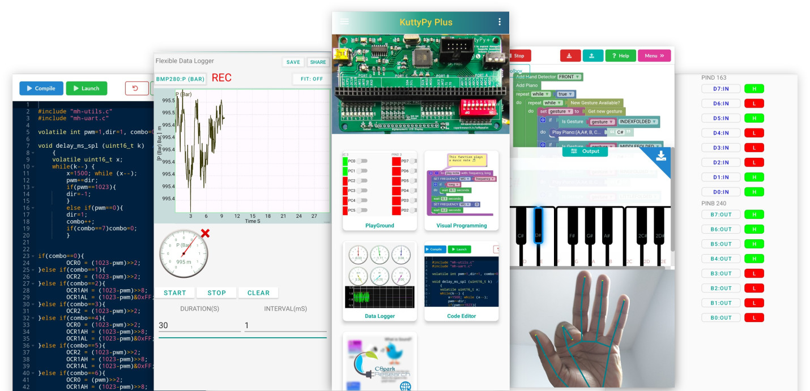
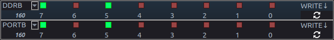
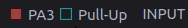
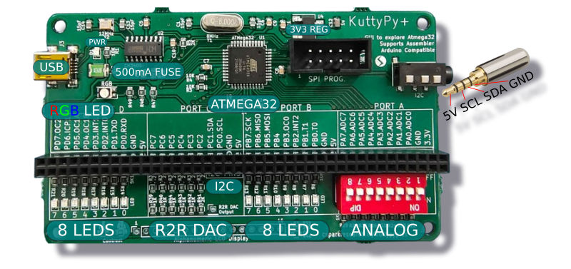
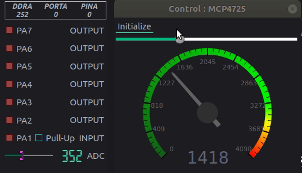



<section id="home" data-parallax="scroll" data-image-src="assets/seelab-benchtop/bg.jpg" data-natural-width=2600 data-natural-height=1463>

    

    
        

        
                     
            

                <h3 data-aos="fade-up">Introducing SEELab3: Workbench</h3>

                <h1 data-aos="fade-up">
                    A versatile collection of test and measurement equipment!
                </h1>

                

                    <a href="#download" class="smoothscroll button stroke">
                        
                        Download App
                    </a>
                    <a href="https://www.youtube.com/watch?v=9xXyL25D2jo" data-lity class="button stroke">
                        
                        Watch Video
                    </a>
                
                                         

            

            

                
            

        

    
  

    <ul class="home-social-list">
    <li>
        <a href="https://instagram.com/csparkresearch" target="_blank"><i class="fa fa-instagram"></i></a>
    </li>
    <li>
        <a href="https://www.youtube.com/playlist?list=PLZY1OXNn8xkkXhq3xa32-X_m7yRx8Kl5j" target="_blank"><i class="fa fa-youtube-play"></i></a>
    </li>
    <li>
        <a href="https://twitter.com/csparkresearch?lang=en" target="_blank"><i class="fa fa-twitter"></i></a>
    </li>
    <li>
        <a href="https://twitter.com/csparkresearch?lang=en" target="_blank"><i class="fa fa-facebook-square"></i></a>
    </li>

    </ul>

    

        <a href="#about" class="scroll-icon smoothscroll">
            Scroll Down
            <i class="icon-arrow-right" aria-hidden="true"></i>
        </a>
    

</section> 

<section id="about">

    

        

            <h1 class="intro-header" data-aos="fade-up">About The Device</h1>
            

                    <a href="{{product.apidocs}}" target="_blank" class="button stroke pill full-width">
                        
                        Python Docs
                    </a>
            

        

        

            

        SEELab3(Benchtop Version) is a valuable tool for hands-on learning in science and engineering, promoting practical understanding and experimentation in various scientific concepts. 
		Into a compact USB powered format it packs a range of essential tools for studying circuits - Oscilloscope, Waveform Generators, RC Meter, Voltage sources.
        Digital I/O , Timing measurement tools, I2C/SPI interface, Power supplies, and more ...
            

        
                       
        
    

    
</section>

<section id="pricing2" data-parallax="scroll" data-image-src="assets/kpimages/bg2.jpg" data-natural-width=1334 data-natural-height=751>

    

        

            

                <i class="icon-window"></i>

                

                    <h3>Python Programmable</h3>
                    
The Python library allows full control over the registers of the microcontroller. It can perform live bit manipulation, read/write over communication buses, and analyze and visualize acquired data.
                    

                    

                        
                    

                    
Combine with powerful Python modules like Numpy, Scipy, Matplotlib for data analysis and visualization

                

                
 

                

                    <i class="icon-file"></i>

                

                    <h3>C Code IDE</h3>

                    
The KuttyPy IDE on your laptop comes with over 50 example codes in C and Assembly to teach you the fundamentals. AVR-GCC is used to compile code, and the IDE uploads it. Compatible with the Arduino IDE.
                    

                    

                        
                    

                    
50+ Simple examples for blinking LEDs, Reading ADCs, and operating PWM outputs

                

            
 

            

                <i class="icon-gift"></i>

                

                    <h3>Visual Code</h3>

                    
The drag and drop coding interface on the android app makes it easy to use your KuttyPy to control real world events. It includes AI gesture recognition blocks , and demo games to make learning to code fun.

                    

                        
                    

                    
Several examples ranging from plotting sine waves, to a gesture controlled robotic arm

                

            
 <!-- /bgrid -->

        
 <!-- end features-list -->

    
 <!-- end about-features -->

</section>

<section id="mobileapp">

    

       

    
 

    

        <h1 class="intro-header" data-aos="fade-up">What Can It Do?</h1>

        

            

                

                    <h3>
                            Register Bit Manipulation</h3>
                    
 With no Compile/Upload Hassle, one can : Monitor every input, Toggle every output, Access Peripherals such as PWMs and Counters, log/plot ADC readings, Scan for I2C sensors, plug and play over 10 common I2Csensors.
                    

                    

                

                

                    <h3>Graphical Programming</h3>
                    
Includes a visual coding interface built on Blockly that allows dragging and linking graphical segments to form logical sequences with parallel generation of typed code. Over 50 examples included to perform various tasks such as sensor data logging, and AI enabled games.
                    

                    
                

                

                    <h3>C Code IDE</h3>
                    
Built-in C code editor with over 100 C and Assembly examples focused on fundamental learning. It is also compatible with the Arduino IDE, and can be used after downloading the board package into the IDE. The android app features a cloud based compiler.
                    

                

                

                    <h3>Test and Measurement</h3>
                    
The software control of I/O pins, ADCs, communication buses enable this to be used as a data acquisition and control device. Simple tasks such as logging voltage, or readings from sensors for magnetic fields, luminosity, pressure, humidity etc can be done with no-coding knowledge.
                    

                    

                        

                            
                        

                        

                            
                        

                    

                

            

       
 

    
 

</section> 

<section id="components" data-parallax="scroll" data-image-src="assets/kpimages/bg2.jpg" data-natural-width=1334 data-natural-height=751>

    

        <h3 data-aos="fade-up"  style="text-align:center;color:white;">The Hardware</h3>

        

            
        

    

    

        

            

                

                    <h3>USB Connectivity</h3>
                    
 Attach to your PC/Phone to control and monitor the hardware
                    

                

            
 
            

                

                    <h3>LED Arrays</h3>
                    
 8 SMD LEDs each on PORTD and PORTB for various demonstrations
                    

                

            
 
            

                

                    <h3>Switch Array</h3>
                    
 DIP switch array on PORTA for read_input demo. 
                    

                

            
 
            

                

                    <h3>6-bit R2R DAC</h3>
                    
 Resistor ladder built into pins PC2-PC7 for a 6 bit DAC.  
                    

                

            
 
            

                

                    <h3>RGB LED</h3>
                    
Common Anode RGB LED with inputs connected to PB3, PD5, and PD7 which have PWM modules attached.  
                    

                

            
 
            

                

                    <h3>I2C Connector</h3>
                    
I2C is available on PC0, PC1 for connecting sensors. Reduce messy wires with a dedicated 4 pole socket.  
                    

                

            
 
            

                

                    <h3>Resettable Fuse</h3>
                    
Protects against accidental short circuits. Resets automatically  
                    

                

            
 
            

                

                    <h3>Display Port</h3>
                    
Port for soldering a 16 character display. Also includes resistor pads for adjusting contrast and backlight.  
                    

                

            
 

        
 <!-- end features-list -->

    
 <!-- end about-features -->

</section>

<section id="pricing">
    

        

            <h1 class="intro-header" data-aos="fade-up">Add-On Sensors</h1>

            
Access add-on sensors and controllers via I2C
            

            

                
            

            

                <video width="320" height="240" controls autoplay muted playsinline loop id="videoId">
                  <source src="/assets/kpimages/joystick.webm" type="video/mp4" >
                  Your browser does not support the video tag.
                </video>
            

        

        

            

                

                    

                        

                            <h3 class="plan-block-title">Supported</h3>
                        

                        

                            <ul class="plan-block-features">
                                <li>BME280: Temp, Pressure, Humidity</li>
                                <li>TSL2561: Luminosity Sensor</li>
                                <li>HMC5883: 3 Axis Magnetometer</li>
                                <li>MPU6050: 6 DOF IMU: Accel+Gyro</li>
                                <li>MLX90614: Passive IR Temperature</li>
                                <li>AHT10: Humidity Measurement</li>
                                <li>ML8511: Analog UV sensor</li>
                                <li>MAX30100: Heart rate and Oximetry</li>
                            </ul>
                        

                    

                

                

                    

                        

                            <ul class="plan-block-features">
                                <li>PCA9685: 16 Channel PWM</li>
                                <li>MCP5725: 12 bit DAC</li>
                                <li>QMC5883: Magnetometer</li>
                                <li>BH1750: Luminosity Sensor</li>
                                <li>AD8232: ECG Instrumentation Amp</li>
                                <li>ADS1115: 16 bit ADC</li>
                                <li>TCS34725: RGB Color Sensor</li>
                                <li>ADXL345: 3 Axis Accelerometer</li>
                                <li>INA219: Current Meter</li>
                            </ul>
                        

                    

                
 

            

        
 

    
 
</section> 

<section id="download">

    

        

            <h1 class="intro-header"  data-aos="fade-up">Download The Companion App!</h1>

            

                KuttyPy works with connected PC/Android devices. It can be installed for various platforms - Ubuntu, Windows, and Android. If you
                have a Python3 interpreter installed, the kuttyPy package can be installed via Pip: `pip install kuttyPy`
            

            

                On windows, a standalone executable installer is available, but Pip is recommended. <a style="color:red" href="{{product.windows}}">Download EXE</a>
            

            <ul class="download-badges">
                <li><a href="{{product.ubuntu}}" title="" class="badge-ubuntustore"  data-aos="fade-right">Ubuntu Deb</a></li>
                <li><a href="{{product.android}}" target="_blank" title="" class="badge-googleplay" data-aos="fade-left">Play Store</a></li>
            </ul>

        

    

</section> 

<section id="testimonials">

    

        

            <h1 class="intro-header" data-aos="fade-up">User Reviews.</h1>
        
   		
    

    

        

            

                

                    

                    Sometimes I got nothing to say.
                    
 

                    

                            
                            

                                Tony Soprano
                                Mob Boss
                            

                    
                 
                
 

                

                    

                    What I’m saying is…
                    
 

                    

                            
                            

                                Christopher Moltisanti
                                Made Man
                            

                    
                 
                
 

                

                    

                    Don't touch that! My program's coming on...
                    

                    

                            
                            

                                Paulie Gualtieri
                                "Walnuts"
                            

                    

                

                

                    

                        You're only as good as your last hex file.
                    

                    

                            
                            

                                Silvio Dante
                                right hand
                            

                    

                

            
  

        

        
    
 

</section> 

