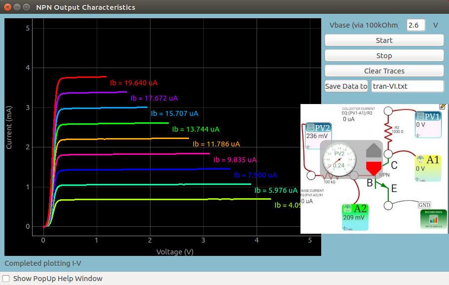
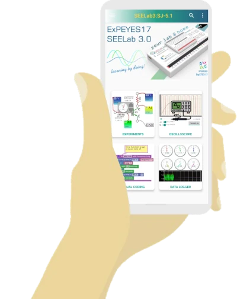
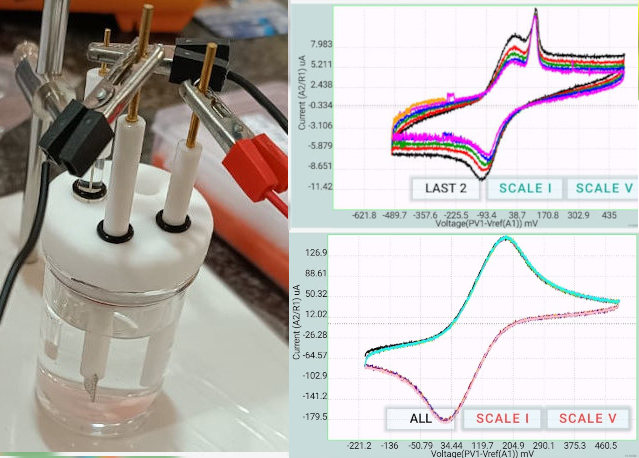
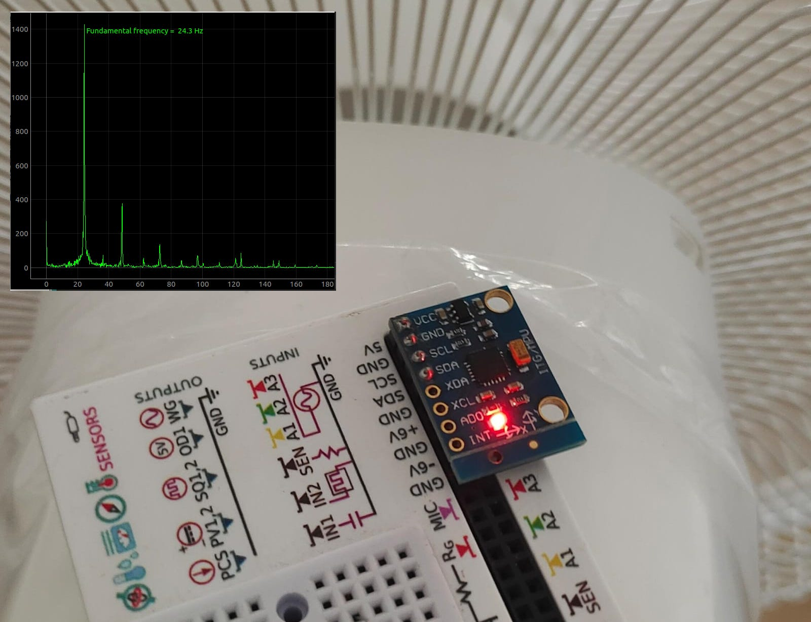



<section id="home" data-parallax="scroll" data-image-src="assets/images/seelab3/bgdark2.jpg" data-natural-width=2600 data-natural-height=1463>

    
        

        
                     

            

            

                <a href="#topdownloads" class="ui green outline button smoothscroll">
                <i class="left download icon"></i>
                Download
                </a>

                

                    

                        

                            <a style="color:magenta" href="https://instagram.com/csparkresearch" target="_blank"><i class="fa fa-instagram"></i></a>
                        

                    

                    

                        

                        <a style="color:red" href="https://www.youtube.com/playlist?list=PLZY1OXNn8xkkXhq3xa32-X_m7yRx8Kl5j" target="_blank"><i class="fa fa-youtube-play"></i></a>
                        

                    

                    

                        

                        <a style="color:white" href="https://twitter.com/csparkresearch?lang=en" target="_blank"><i class="fa fa-twitter"></i></a>
                        

                    

                    

                        

                        <a style="color:blue" href="https://twitter.com/csparkresearch?lang=en" target="_blank"><i class="fa fa-facebook-square"></i></a>
                        

                    

                

            
                                         

        

    
  

</section> 

<section id="about" style="padding-top:5rem;">

    

        

            <h1 class="intro-header" data-aos="fade-up">Your Lab @ Home...</h1>

                

                    <a href="{{product.onlinedocs}}" target="_blank" class="ui compact labeled primary inverted icon button mybutton">
                        <i class="chrome icon"></i>
                        Docs @ Scischool.in
                    </a>

                    <a href="{{product.brochure}}" target="_blank" class="ui compact labeled inverted pink icon button mybutton diagonal-rainbow ">
                        <i class="ui file icon"></i>
                        PDF Brochure
                    </a>
                

                

                    <a style="margin-top:1em !important;" href="/seelab3-technical" target="_blank" class="ui compact  labeled inverted violet icon button mybutton">
                        <i class="ui settings icon"></i>
                        Technical specs
                    </a>
                    <!-- Purchase button that opens modal -->
                    <a style="margin-top:1em !important;" class="ui compact labeled yellow icon button mybutton" onclick="$('#purchaseModal').modal('show');">
                        <i class="ui cart icon"></i>
                        Purchase
                    </a>
                

        

        

            <h5 class="lead text-justify" data-aos="fade-up">
                SEELab3 is a versatile multi-purpose test and measurement tool, designed as the successor to the popular ExpEYES-17 platform. It brings a complete laboratory to your home or classroom in a compact, affordable package. 

The device interfaces with your PC or Android phone through USB, providing oscilloscope functionality, signal generation, data logging capabilities, and support for numerous sensors. With its Python programmable interface and intuitive graphical applications, SEELab3 makes scientific experimentation and electronics exploration accessible to students, hobbyists, and professionals alike.
            </h5>
        
                       
    

    

    

    

        

            

                

                    <a class="header" href = "#download">Downloads for {{product.name}}</a>
                    

                        {{product.installdescription}}				
                    

                    

                        <a class="ui right floated animated fade primary  button small" href="{{product.user-manual}}">
User Manual

<i class="right download icon"></i>Download
</a>

                        <a class="ui right floated animated fade primary  button small" target="_blank" href="{{product.apidocs}}">
Library Docs

<i class="right book icon"></i>Read the docs
</a>

                        <a class="ui right floated animated fade orange  button small" href="{{product.source}}">
Source

Get Zip
</a>

                        

                        <a class="ui positive animated fade button" href="{{product.ubuntu}}">
Ubuntu

Deb<i class="ui right linux icon"></i>
</a>
                        

                        <a class="ui negative animated vertical button" href="{{product.windows}}">
Windows(Legacy)

<i class="ui windows icon"></i>Exe
</a>
                        

                        <a class="ui negative animated vertical button" href="{{product.windowsnew}}">
Windows(New)

<i class="ui windows icon"></i>Exe
</a>

                        

                        <a class="ui color blue animated fade button" href="{{product.android}}">
Android

Play Store
</a>

                        

                    

                

            

        

    

    

</section>

<section id="pricing2" data-parallax="scroll" data-image-src="assets/kpimages/bg2.jpg" data-natural-width=1334 data-natural-height=751>

    

        

            

                

                
                

                

                    
Oscilloscope

                    

                        <a>A1,A2,A3,MIC | Max 2MSPS , +/-16V</a>
                    

                    

                        4-Channel Digital Oscilloscope with advanced triggering, real-time FFT analysis, and XY plotting capabilities. Sample rates up to 2 MSPS. +/-16V on A1, and A2, with amplification up to +/-250mV range. Fourth channel for microphones

                    

                

            

            

                

                    
                    

                    

                    
Waveform Generators

                    

                        <a>WG, SQ1, SQ2 , CS3</a>
                    

                    

                    Programmable Waveform Generator capable of producing Sine, Triangle, and Square waves. 
                    Sine Frequency range from 1Hz to 5KHz with amplitude control up to +/-3V. Square waves up to 8MHz. Clock output up to 64MHz
                    

                

            

            

                

                    
                    

                    

                    
DACs and Voltmeters

                    

                        <a>PV1,PV2 | A1,A2,A3,SEN</a>
                    

                    

                    2x programmable bipolar voltage outputs with 12 bit resolution. +/-5V and +/-3V . Multiple voltmeters with programmable ranges from +/-260mV to +/-16V. Mainly used for I-V characterisation
                    

                    

                    Diode IV , Solar cell characterisation, NPN/PNP input/output/load lines, driven pendulums, and more..
                    

                

            

<!--
            

                

                    
                    

                    

                    
Visual Coding

                    

                        <a>Similar to Scratch</a>
                    

                    

                    The drag and drop coding interface makes it easy to develop workflows to control real world events. 
                    It includes blocks to perform data acquisition, analysis , and visualization in addition to standard coding operators
                    

                    

                    50+ code examples for experiments. from plotting sine waves, sine fitting, and LCR steady state response
                    

                

            

-->

        

     

    

    

        

            

                

                    <h3 style="display: inline;">Visual Code</h3>

                    
The drag and drop coding interface makes it easy to develop workflows to control real world events. 
                    It includes blocks to perform data acquisition, analysis , and visualization in addition to standard coding operators.

                    

                        
                    

                    
50+ code examples for experiments. from plotting sine waves, sine fitting, and LCR steady state response

                

            
 <!-- /bgrid -->
            

            

                

                    <h3 style="display: inline;">Elementary to Advanced</h3>

                    
Youngsters can get started with simple experiments such as making lemon cells, parallel plate capacitors,
                    dynamos. Excellent for demonstrating STEM principles. 

                    

                        
                    

                

            
 <!-- /bgrid -->

            

                

                    <h3>100+ Experiments</h3>

                    
With this unique combination of tools tailor made for science education, a vast range of experiments are possible

                    

                        
                    

                    
School Level science, electronics, electrical, mechanics, electrochemistry, acoustics...

                

            
 <!-- /bgrid -->

        
 <!-- end features-list -->

    
 <!-- end about-features -->

     
    

        

            

                

                
                

                

                    
Android Compatible

                    

                        <a>Fully Portable testbench !</a>
                    

                    

                        Use your Android device as a portable lab with our <a href="#downloadbuttons">feature-rich app</a>. Includes visual programming interface and 100+ experiment templates.
                    

                    

                    Integrated with your phone's built-in sensors, GPS, and communication pathways for IoT experiments
                    

                

            

            

                

                    
                    

                    

                    
I2C Sensor Hub

                    

                        <a>12+ sensors</a>
                    

                    

                    Connect and control <a class="smoothscroll" href="#components">multiple I2C sensors</a> simultaneously. Built-in support for temperature, pressure, motion, and many other sensor types
                    

                

            

            

                

                    
                    

                    

                    
Essential Accessories

                    

                        <a>Included with the kit</a>
                    

                    

                    A basic set of passive components and accessories are included in the kit to help you get started right away. These include resistors, capacitors, motor, buzzers, coil, LDR, and an SR04 sensor
                    

                    

                    Sufficient for more than 50 experiments!
                    

                

            

        

    

    

    

        

        
        <a class="card randomcard" href="{{ link.link }}" target="_blank">
            

                

                    {{ link.title }}
                

                

                    {{ link.description }}
                

            

        </a>
        
        

    

</section>

<section id="mobileapp" >

    

       

    
 

    

        <h1 class="intro-header" data-aos="fade-up">So, what else can you do with it?</h1>

        

            

                
            

            

<!--- EXTRA FEATURES -->

        

            

                

                    <h3>PID Controller</h3>
                    

                        
                    

                    
Choose any input and any output! Temperature controllers, magnetic field stabilizers, drone stability principles...

                

            
 

            

                

                    <h3>Cyclic Voltammetry</h3>
                    

                        
                    

                    
Wire up a 3 opamp circuit, and use SEELab'3 voltmeters and DACs to explore redox electrochemistry. Shown traces are for FeCN6+KCl , and an Ionic liquid. A simple CV experiment with a 1K resistor is also built-in

                

            
 

            

                

                    <h3>Sensor Oscilloscope</h3>
                    

                        
                    

                    
The sensor oscilloscope gets precise time correlated data from sensors. Used to study vibrational modes of mechanical oscillators. The speed of this BLDC fan was calculated from the FFT of data from an accelerometer

                

            
 <!-- /bgrid -->            

        
 <!-- end features-list -->

<!--- EXTRA FEATURES END-->

            
                       
            

        
            
            

                

                    <h3><a href="{{product.android}}" target="_blank">Android Phone Lab</a></h3>

                    
Record data from your phone's sensors! Accelerometer, gyro, magnetometer, luminosity... Plot/Analyse raw data. measure sub-millisecond time gaps between noises with the interactive acoustic stopwatch

                    

                        
                    

                

            
 <!-- /bgrid -->

            

                

                    <h3>Online Courses</h3>

                    
Check out MOOC courses on Moodle. Tailored for different audiences

                    <a class="ui fluid button fade pink" href = "https://alpha.scischool.in/" target="_blank">Scischool.in</a>
                    
Course material developed by Dr. Ajith Kumar For Scischool.in

                    

                        
                    

                

            
 <!-- /bgrid -->

            

                

                    <h3>Programmable</h3>

                    
Open source python library lets you integrate it into complex setups

<pre class="highlight"><code>from expeyes import eyes17
p=eyes17.open() 
p.set_pv1(1) # +1 Volt output on PV1
v = p.get_voltage('A1') #Read voltages from A1 input

</code></pre>
              

                

                <a class="ui fluid button inverted red" href = "{{product.apidocs}}" target="_blank"><i class="ui book icon"></i>Reference Manual</a>
                <a class="ui fluid button inverted green" href = "https://pypi.org/project/eyes17lib/" target="_blank"><i class="ui python icon"></i>Pip package</a>
                <a class="ui fluid button inverted blue" href = "https://github.com/expeyes/expeyes-programs/tree/master/eyes17/eyes17" target="_blank"><i class="ui github icon"></i>Source Code</a>
                

            
 <!-- /bgrid -->

            

                

                    <h3>General Robotics</h3>
                    

                        
                    

                    
This 4-DOF affordable robotic arm can be controlled via your phone using the visual coding interface. SEELab3 controls the servos via a PCA9685 servo controller, and responds to hand gestures detected with AI.

                

            
 

        
 <!-- end features-list -->

        

    
 

</section> 

<section id="components" data-parallax="scroll" data-image-src="assets/kpimages/bg2.jpg" data-natural-width=1334 data-natural-height=751>

    <h1 data-aos="fade-up" style="text-align:center;color:white;"><a href="https://eyes17lib.readthedocs.io/en/latest/programming/sensors/" target="_blank">Sensors (I2C / SPI)</a></h1>
    

        

            

                
            

            

                
            

            

                
            

        

        

            

                <ul class="plan-block-features">
                    <li>BME280: Temp, Pressure, Humidity</li>
                    <li>AD8232: ECG Amplifier module</li>
                    <li>TSL2561: Luminosity Sensor</li>
                    <li>HMC5883: 3 Axis Magnetometer</li>
                    <li>MPU6050: 6 DOF IMU: Accel+Gyro</li>
                    <li>MLX90614: Passive IR Temperature</li>
                    <li>AHT10: Humidity Measurement</li>
                    <li>ML8511: Analog UV sensor</li>
                    <li>MAX30100: Heart rate and Oximetry</li>
                    <li>AD9833: 24 bit DDS sine wave generator</li>
                </ul>

            

        
 

        

            

                    <ul class="plan-block-features">
                        <li>PCA9685: 16 Channel PWM</li>
                        <li>HX711: 24 bit ADC for load cells</li>
                        <li>MCP5725: 12 bit DAC</li>
                        <li>QMC5883: Magnetometer</li>
                        <li>BH1750: Luminosity Sensor</li>
                        <li>AD8232: ECG Instrumentation Amp</li>
                        <li>ADS1115: 16 bit ADC</li>
                        <li>TCS34725: RGB Color Sensor</li>
                        <li>ADXL345: 3 Axis Accelerometer</li>
                        <li>INA219: Current Meter</li>
                    </ul>
            

        
 

    
 

</section>

<section id="clients">

</section>

<section id="publications">


</section>

<section id="download">

    <h3>Blog posts</h3>
    
    

            

            

                    <!--

                        
                    
-->
                    

                    

                        <a href="{{post.url}}">{{post.title}}</a>
                    

                    

                    {{post.summary}}
                    

                    

                            <a>{{cat}}/</a>
                    

                    

                    
{{ post.date | date: '%B %d, %Y' }}

                        
                        <!--
                        <a class="ui basic image large label right floated">
                        
                        {{author.name}}
                        </a>
                        -->
                    

                

            

            

    

</section> 

<!-- Modal definition -->

    <i class="close icon"></i>
    

        Contact Us for Purchase
    

    

        

            

                <!-- Contact Form Column -->
                

                    <form id="my-form" class="ui form" method="post" action="https://formspree.io/f/meoalegr">
                        

                            <label>Name</label>
                            <input type="text" name="name" placeholder="Your Name">
                        

                        

                            <label>Email</label>
                            <input type="email" name="email" placeholder="Your Email">
                        

                        

                            <label>Subject</label>
                            <input type="text" name="subject" placeholder="Subject" value="SEELab3 Query">
                        

                        

                            <label>Message</label>
                            <textarea name="message" placeholder="Your Query">Need a quotation for SEELab3...</textarea>
                        

                        

                        <button id="my-form-button" class="ui primary button" type="submit"><i id="submit-loader" class=""></i>Send Message</button>
                        

                    </form>
                

                
                <!-- Contact Info Column -->
                

                    
                    <h4>Vendors</h4>

                    

                    
                    

                        

                         
                        
                        

                            {{ v.name }}
                        

                        
                        <a class="meta" >
                            <i class="red mail icon"></i>{{ v.email }}
                        </a>
                        
                        

                            {{ v.address }}
                        

                        

                        

                        

                            <a class="ui basic small green button" href="{{v.link}}" target="_blank"><i class="cart icon"></i>Buy</a>
                            <a class="ui basic small blue button" href="tel:{{v.contact}}"><i class="phone icon"></i>Contact</a>
                        

                        

                    

                    
                    

                     
                    <h4>Manufacturer</h4>
                    

                        

                            <i class="envelope icon"></i>
                            

                                <a href="mailto:csparkresearch@gmail.com">csparkresearch@gmail.com</a>
                            

                        

                        

                            <i class="phone icon"></i>
                            

                                <a href="tel:+918851100290">(+91) 8851 100 290</a>
                            

                        

                    

                

            

        

    

